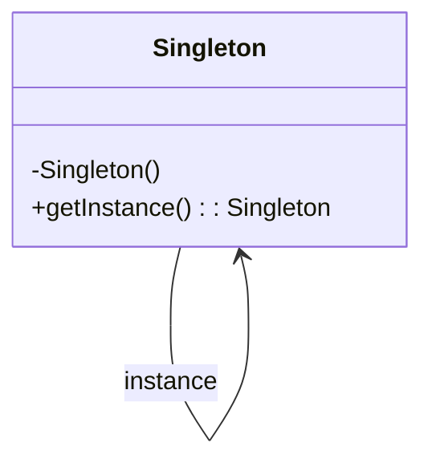

## Erklären Sie das Konzept der Datenkapselung allgemein und anhand eines Beispiels. Wie könnten Sie das Konzept der Datenkapselung verletzen? Wie steht dieses Konzept mit Klassenhierarchie und Vererbung in Zusammenhang?


### Klassenhierarchie:
Instanzvaribale(:=Attribute) werden immer vererbt, jedoch ist der Zugriff nur möglich wenn diese Protected oder public.

## Was versteht man unter "Patterns"? Erklären Sie zwei PAtterns genauer (inkl. Code-Beispiel, Klassendiagramm oder Sequenzdiagramm).

verallgemeinerte Lösungsansätze für wiederkehrende Probleme
````java
public class Observer(){//Client
  private Subject servzer;

  public Observer(){}

  public void update(){..};

}

public class Subject{//server
  private Collection<IObserver> notificationList;

  public boolean register(){..}
  public Type getChanges(){..}
  public boolean unregister(){..}
}
````
#### Observer Klassendiagramm
````mermaid
classDiagram
ProductManager -->"0..*"IObserver: -observers
ProductViewer --> "1"ISubject: subject

  class ISubject{
   <<interface>>
  +register(obs: IObserver):boolean
  +unregister(obs: IObserver): boolean
  +getChanges(): TYPE
  }
  class IObserver{
<<interface>>
  +update(): void
  }
  class ProductManager{
    +addProduct(product: IProduct): void
    +getChanges(): Collection<IProduct>
    +notifyObservers(): void
  }
  class ProductViewer{
    -products: Collection<IProducts>
    +update(): void
  }
````

````java
public class Singleton{
  private Singleton INSTANCE;

  private Singleton(){}

  public static Singleton get_instance(){
    if(this.INSTANCE == null)
      this.INSTANCE = new Singleton();  
    return this.INSTANCE;
    }
}
````

#### Singleton Klassendiagramm



`````java
public class Singelton{
  private Singelton instance;
  private Singleton(){}
    public static Singleton get_instance(){
      if(this.instance == null);
        this.instance = new Singleton();
      return this.instance;
    }
}
````

````java
public interface IObserver{ //subscriber
  public void notifyDataChanged();
}
public class Subject {//publisher
//Instanzvariable & Konstruktor
  public void register(){//Methodenrumpf
  }
  public void unregister(){//Methodenrumpf
  }
}

````
