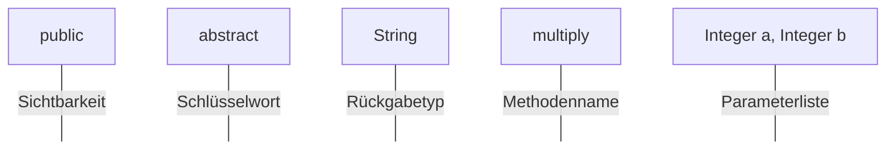
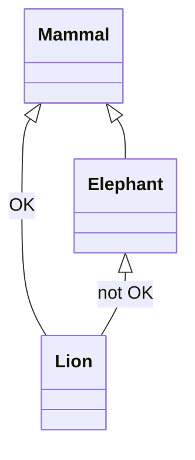

# 1. Was ist eine Klasse?

- Klassen sind Baupläne/Schablonen für Objekte (Instanzen)

- Sie bieten Konstruktoren zur Objekterzeugung an

- Von einer Klasse können mehrere Objekte erzeugt werden

- Sie spezifizieren ihr Verhalten über Methoden

- Bieten öffentliche Schnittstellen um den Zustand eines Objektes von außen zu können

# 2. Was ist ein Objekt im Sinne von OOP?

- Objekte (Instanzen) sind konkrete Realisierungsregeln von Klassen

- Haben einen konkreten Zustand (Instanzvariablen der Klasse)

- Jedes Objekt hat zur Laufzeit eine Repräsentation im Speicher

- Manipulation des Objektzustandes $\rightarrow$ über die Methoden der Klasse

# 3. Was ist die Object-Klasse?

- Alle Klassen erben von Object

- Alle selbst erstellte Klassen erben implizit auch von Object

- Object Methoden können mit eigener Implementierung überschrieben werden

# 4. Was ist der Konstruktor?

- Dient zur Objekterzeugung von Klassen

- werden bei der Erzeugung von Objekten einer Klasse aufgerufen

- Initialisieren den Objekt-Zustand

- NAme des Konstruktors $\hat{=}$ Klassennamen

- wird kein Konstruktor explizit definiert $\Rightarrow$ erstellt Compiler einen Default-Konstruktor leere ** Tabelle **

- Mehrere Konstruktoren mit unterschiedlicher Signatur möglich

- Verwendung von set-Methoden vermeiden

- Construktor-Chaining = in einem Konstruktor wird ein anderer Konstruktor aufgerufen:  

  - einer der eigenen Klassen

  - einer der direkte Oberklasse

  $\rightarrow$ das muss an erster Stelle passieren

```java
public class Vehicle{
    private Motor engine = null;
    private String name = null;
    public Vehicle(){
        this.name = new String(" ");
    }
    public Vehicle (Motor engine){
        this.Vehicle(); //an erster Stelle
        this.engine=engine;
    }
    public Vehicle (Motor engine, String name){
        this.name=name; //oder anderer Konstruktor möglich
        this.engine = engine;
    }
}
```

# 5. Objekterzeugung - Ablauf + Zusammenhang mit Vererbung (Erzeugung)

```java
Vehicle car = new Vehicle ("BMW", null);
```

1. Referenzvariable car wird am Stack angelegt und mit null belegt

2. new-Operator von Vehicle wird aufgerufen. Auf dem JAva-Heap wird der Platz für ein Objekt der Klasse Vehicle reserviert $\Rightarrow$ Objekt wird instanziiert.

3. Datenfleder des Objekts werden inititialisiert

4. Methodenblock des Konstruktors wird ausgeführt

5. new-Operator gibt die Refefinalize-renz auf das erzeugte Ibjekt zurück

6. Referenz wird in Varriable car gespeichert.
- In Variable wird Referenz auf das Objekt gespeichert

- Konstruktor-Chaining

- Dynamisches Binden $\rightarrow$ Bsp. mit Super & Subklasse

# 6. Garbagecollector

- Wenn auf dem Heap Speicher von Objekten liegen auf die nicht mehr referenziert wird $\Rightarrow$ werden die automatisch freigegeben

- erkennt auch zyklisch regerenzierte Objekte die nicht mehr verwendet werden

- Memory Leaks weiterhin möglich

- finalize-Methode wird vor dem  Zerstören des Objektes aufgerufen

# 7. Methodenaufruf

###### Aufruf einer Instanzmethode:

```java
myObject.methodName(par1,par2,...);
```

###### Aufruf einer statischen Methode:

```java
ClassName.methodName(par1,par2,...);
```

# 8. Methodensignatur

- definiert die formale Schnittstelle einer MEthode

- enthält Name der Funktion, Anzahl und Reihenfolge der kompartiblen Parameterdatentypen (Bei Java:nicht der Rückgabetyp)



In Java gehört der Rückgabetyp nicht zur Signatur

# 9. Parameterübergabe

- primitive Datentypen $\Rightarrow$ als Kopie übergeben

- bei Objekten $\Rightarrow$ Kopie der Referenz auf das Objekt übergeben (Copy by Value-Reference)

# 10. Overloading

- 2 oder meht Methoden haben exakt die gleichen Methodennamen aber unterschiedliche Parameterlisten

- Rückgabetyp wird icht berücksichtigt

- Mechanismus zeigt sich zur Compile-Time

  ```java
  public class Overloading{
      public Integer add(Integer a, Integer b){...}
      public Integer add(Integer a, Integer b, Integer c){...}
      public Float add(Integer a, Integer b, Float c){...}
  }
  ```

# 11. Statische Methode

- Ist nicht mit einem Objekt verbunden

- Keine Instanz notwendig um Methoden aufzurufen $\Rightarrow$ über Klassenname

  ```java
  public class StaticExample{
      public static Integer add(Integer a, Integer b){...}
      // int result = StaticExample.add(12,44);
  }
  ```

# 12. Abstrakte Methoden

- legen nur Methodensignatur fest

- es gibt keine Implementierung (kein Methodenblock)

- erbt eine nicht abstrakte Klasse von einer abstrakten, müssen alle abstrakte Methoden implementiert werden

# 13. Abstrakte Klassen

- definieren auch einem Typ

- von abstrakten Klassen kännen keine Instanzen erstellt werden

- können abstrakte Methoden beinhalten

- von einer abstrakte Klasse kann geerbt werden

- erbt nicht abstrakt von abstrakte Klasse $\Rightarrow$  müssen alle abstrakte Methoden implementiert werden

- Enthält eine Klasse eine abstrakte Methode $\Rightarrow$ muss die Klasse abstrakt sein

# 14. Primitive Datentypen

- sind keine Klasse

- für jeden primitiven Datentyp git es eine eigene Wrapperklasse

- automatische Konversion zwischen den beiden über Auto/Unboxing

| Basistyp | Wrapperklasse |
| -------- | ------------- |
| int      | Integer       |
| long     | Long          |
| float    | Float         |
| boolean  | Boolean       |
| byte     |               |
| short    |               |
| double   |               |
| char     |               |

# 15. Vererbung

- Dient zur Erweiterung/Einschränkung einer bestehenden Klasse

- Expliziter Zugriff auf Methoden oder Attribute der direkten Oberklasse

- Zugriffsmöglickeit aber abhängig von Sichtbarkeit

- Explizieter Zugriff mit dem Schlüsselwort super

- Vererbung bei Klassen u interfaces möglich

- Vererbung erzwingt keine Subtypenbildung im Sinne von OOP

- nutzt Ähnlichkeiten im Source Code aus

- Untertypen haben ersetzbares Verhalten

- Instanzvariablen werden vererbt & können überdeckt werden

- Instanzmethoden werden vererbt & private Instanzmethoden können in Subklasse überdeckt werden

- Neue Varriablen können angelegt werden

-  Neue Methoden können angelegt werden

- Keine Vererbung von Konstruktoren

```java
class [SUBCLASS] extends [SUPERCLASS] {}
```

# 16. Sichtbarkeiten. Erklären Sie das Prinzip der Datenkapselung allgemein und anhand eines Java-Codes. Wie können Sie das Konzept derDatenkapselung verletzten? Wie steht dieses Konzept mit der Klassenhierachie und Vererbung in Zusammenhang?

- Datenkapselung schützt die Daten eines Objekts vor direktem Zugriff von außen

- Attribute des Objektes mit  <u>private</u> deklariert (nur in dieser Klasse sichtbar)

- set/get-Methode sind <u>public</u> (um von außen mit den variablen zu arbeiten) Sie gewähren Zugriff

- Konzept kann verletzt werden, inddem man die Attribute auf <u>public</u> setzt

- Wenn die Attribute auf <u>protected</u> gesetzt wären, hätte die Subklasse und andere Klassen in dem selben package auch noch zugriff auf die Variable.

#### Sichtbarkeiten bei Attributen und Methoden:

| Schlüsselwort | Sichtbarkeit                                                                     |
| ------------- | -------------------------------------------------------------------------------- |
| - private     | Zugriff nur innerhalb der Klasse                                                 |
| + public      | öffentlicher Zugriff                                                             |
| # proteced    | Zugriff innerhalb der Klassem Klasses des gleichens Packages und einer Subklasse |
|               | Package private - Zugriff nur von Klassen aus dem Package                        |

```java
public class Zahl{
    private int zahl;
    public int getZahl(){
        return this.zahl;
    }
    public int setzahl(int zahl){
        this.zahl = zahl;
    }
}
```

# 17. Attribute und Vererbung

- Attribute mit gleichem Namen und Typ in Superklasse und Subklasse werden nicht überschrieben, sondern überdeckt (hiding field) $\Rightarrow$ Expliziter Zugriff auf das Attirbut der Superklasse mit super

# 18. Methoden und Vererbung

- dient zur Erweiterung des Verhaltens (neue Methode, Overloading)

- dient zur ??? des Verhaltens (Overriding)

# 19. Overriding

- Methode in Subklasse hat die gleiche Signatur wie Methode in der Superklasse

- Mechanismus zeigt sich zur Runtime

- Zugriff auf überschriebene Methode nur mit Super

```java
public class SuperClass{
    proteced Integer lastResult = 0;
    public Integer add(Integer a, Integer b){
        lastResult = a+b;
        return lastResult;
    }
    public class Subclass extends SuperClass{
        public Integer add(Integer a, Integer b);
        super.lastResult = a+b +super.add(a,b);
        return this lastResult;
    }

}
```

# 20. Interface

- ist eine Schnittstellendefinition

- keine Implementierungen, keine Deklaration von Attributen (außer konstante Funktion???) Seite8

- Alle Methoden sind abstrakt (explizit durch Schlüsselwort abstrakt oder implizit)

- deklarieren einen Typ mit möglichen Operationen auf einem Objekt dieses Typs

- Eine Klasse kann mehere Interfaces implementieren und muss die enthaltene Methode implementieren

- Schlüsselwort: implements

| Klasse  v                         | s  Interface                                 |
| ---------------------------------:|:-------------------------------------------- |
| - Kann Methoden implementieren    | - kann dies nicht                            |
| - ist Teil der Klassenhierachie   | - nicht Teil der Klassenhierachie            |
| - kann nur von einer Klasse erben | können von mehreren Interfaces erben         |
|                                   | - ergibt alle Methoden aller Superinterfaces |

# 21. Was ist ein Typ in OOP? Wie steht dieser mit Vererbung und dem Ersetzbarkeitskeitsprinzip im Zusammenhang? Worin unterscheidet sich Spezidisung??? und Vererbung?

- Es hängt von der Sichtweise ab:

  - Sicht des Systemsprogrammieres = Filter für die Interpreteration von Rohdaten

  - Sicht des Implementierers = Speicher-abbildung von Werten

  - Sicht der Typenkontrolle = Kompartibilität von Operator und Operand

  - objektorientierte Sicht = Verhaltensspezifikation

- Klassen und Interfaces definieren Typen

- Vererbungsbeziehungen zwischen Klassen und Interfaces sind möglich

- _Achtung_: Vererbung in Java erzwingt hier Subtypenbildung im Sinne des Ersetzbarkeitsprinzip $\Rightarrow$ dieser besagt, dass überall wo eine Instanz eines Supertyps erwartet wird, eine Instanz eines Subtyüs verwendet werden kann .

- Erfüllung des Ersetzbarkeitsprinzips muss in OOP berücksichtig werden

- spezidisieg = Nebenerscheinung von Vererbung $\Rightarrow$ führt zu einem Subtypen

```java
// 2 Klassen : Pensionist & Person
//               subtyp      supertyp
// Alter Person: 0 .. 120
// Alter Pensionist: 65 .. 120
// Variable Person p1, Pernsionist p2
// p1 = p2 würde fehler ergeben wenn Alter 40 wäre => Klare gesetz
```

*Weiter machen*

# 22. Dynamisches Binden

- wenn ein Methodenaufruf zu Laufzeit anhand des tatsächlichen (dynamischen) Instanztyps eines Objekts aufgelöst wird.

# 23. Was ist Polymorphismus? Anhand eines Java-Codes

- wenn 2 MEthoden den selben Methodennamen + Übergabeparameter haben aber ihre Implementierung unterscheiden sich. (Overriding)

```java
public class MAmmal{
    public String info(){
        return "I am Mammal";
    }
}
public class Elephant extends Mammal{
    public String info(){
         return "I am Elephant";
     }
}
public class Lion extends Mammal{
     public String info(){
         return "I am Lion";
     }
}
public class Demo{
    public static void main(String[]args){
        List<Mammal> mammals = new Arraylist<>();
        mammals.add(new Lion());
        mammals.add(new Elephant());
        mammals.add(new Mammal());
        for ( Mammals m : mammals)
            System.out.println(m.info());
    }
}
```

# 24 Welche Arten von Typumwandlung kennen Sie? Auf was muss bei einer Typumwandlung geachtet werden? Geben Sie Jeweils ein Java Beispiel an. Wie löst der Compiler die Typen auf?

- <u>Typumwandlung (Type-Casting)</u>

  - Typhierache legt Obertyp-Untertyp Beziehgun fest.

  - Entlang eines Astes einer Typenhierachie können Typenmiteinander umgewandelt werden:




- Jede Variable hat 2 Typen:

  - Deklarationistyp: legt fest welche Operation auf der Variable ausgeführt werden

  - Instanztyp : legt fest welche Implementierung der Operation verwendet wird.
